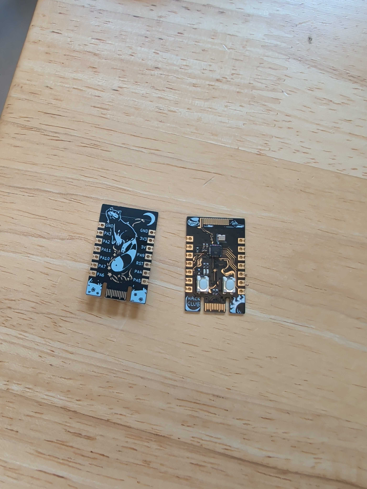
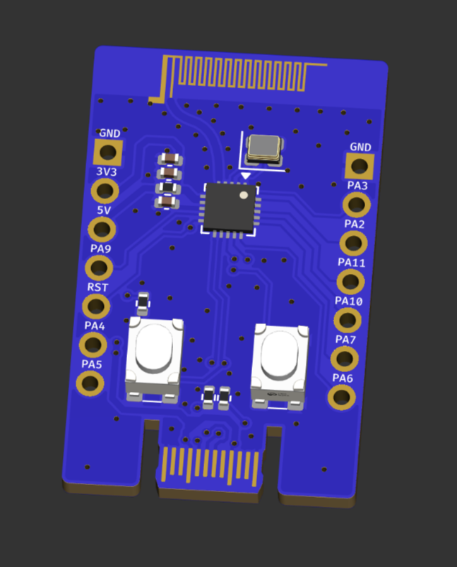
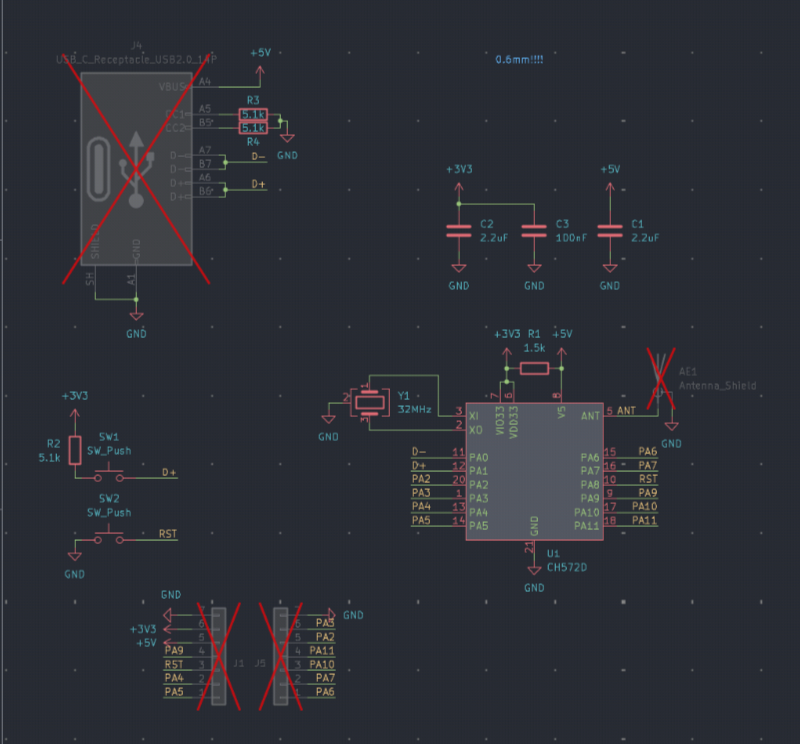
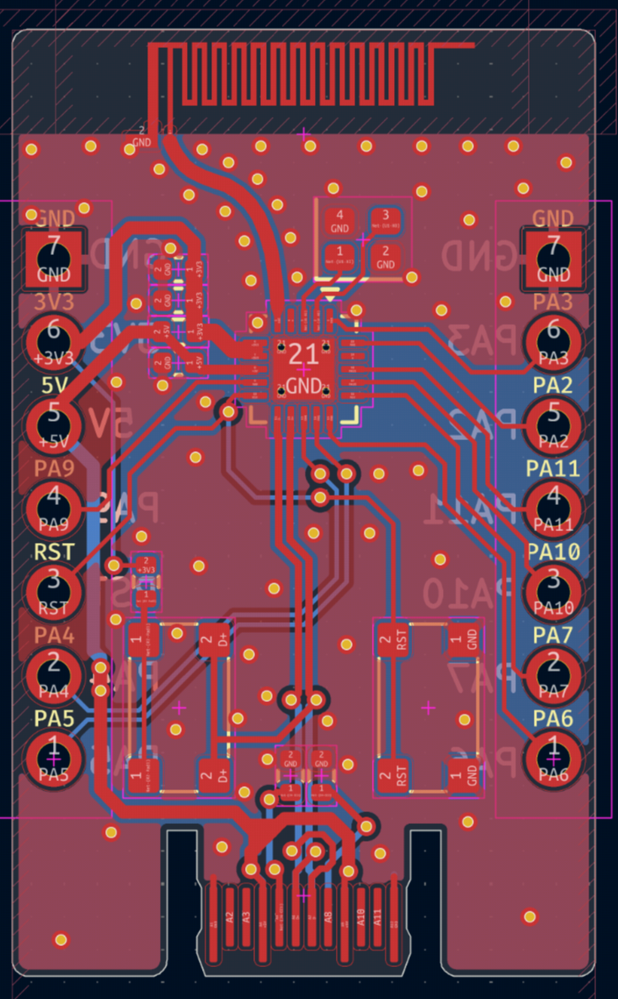

# c57

Low-cost bluetooth devboard with a ch572 MCU. To program it press the boot button, and use either mountriver studio or [ch32fun](https://github.com/cnlohr/ch32fun).

It is also very-low powered, and has on-board USB-C connector.

Features:
- Low-cost wch antenna
- On board antenna 
- Bootloader via USB
- Bare metal
- A lot of gpio
- on board usb c

This devboard lets you do low cost and low powered bluetooth communications. Best used with ch32fun

| Item | Price | Where |
| ---- | ----- | ----- |
| PCB + PCBA | $50 | JLC |

